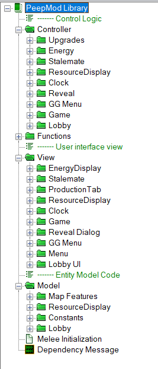

# Starcraft Peep Mod

Starcraft 2 Mod for playing round robin 1v1s in a lobby with many players. Custom Races are supported too. This is a similar concept to the [Peep Mode](https://github.com/Kelzorz/PeepMode) project. However this project is designed to be a Mod. It also supports the scion custom races. Documentation on the Scion mod gameplay [can be found here](https://starcraft-scion-custom-races.fandom.com/). 

# Folder Structure

    .
    └── Mod                     # Folder for the core Mod
       ├── src                  # Mod Source Code
       └── bin                  # The Mod saved as a deployable Project file
    ├── Docs                    # Folder for more documentation
    ├── Maps                    # Maps that use the Mod 
    ├── Test                    # Test Maps with test cases
    ├── Scripts                 # This folder was reserved in case i needed scripts 
    └── Media                   # Used for images and other media
    
# Package Diagram

The project is a [starcraft mod](https://s2editor-guides.readthedocs.io/New_Tutorials/01_Introduction/006_Mods/) which can be used by other starcraft [1v1 maps](https://liquipedia.net/starcraft2/Maps/Ladder_Maps/Legacy_of_the_Void). This mod in turn uses the [Scion Mod](https://sc2arcade.com/map/1/313549/) by [Solstice245](https://github.com/Solstice245/scion-keiron-dev).


# Project Structure



I've separated the project into `Control` logic, user interface `View` and `Model` entities.
Any additional helper functions go in `Functions`. 


# Development and Testing Notes

To do development you will need the scion races source code which is a dependency.  
Go to your starcraft Mods directory. 
For example if you installed starcraft in the default directory on C: drive:

```bash
cd "C:\Program Files (x86)\StarCraft II\Mods"
git clone https://github.com/Solstice245/scion-keiron-dev.git
```

After makeing changes to the Mod soure code in `Mod\src` using the starcraft editor, the project must be saved again as a `.SC2Mod` file. This is what the directory `Mod\bin` is for. This file must be copied to the starcraft Mod folder for starcraft to detect it for testing.

An example of doing this in powershell:

```bash
Copy-Item -Path "\Mod\bin\PeepMod.SC2Mod" -Destination "C:\Program Files (x86)\StarCraft II\Mods\PeepMod.SC2Mod"
```

The map files in the `Test\` folder contain test cases. When run from the editor you can run the test cases in game. Use the command `-Run Unit Tests` in the chat window.


* Additional Testing Commands
  
    `-AI Player` 
    Adds a dummy AI Player to the lobby

    `-AI Player 2` 
    Adds another dummy AI Player to the lobby


These debugging commands are only available in test maps and not the ones in the `Maps` folder as those maps are meant for deployment. 


Some developers might find it convinient to set the default map to one of the test maps


# Adding a new Map

The steps for adding a new map are documented [here](https://github.com/sav-chris/SC2-Peep-Mod/issues/49).


